# 🛫 BookCabin - Airline Voucher Seat Assignment App

> A comprehensive web application for airlines to manage voucher seat assignments with randomized seat selection and duplicate prevention.

## 📋 Overview

BookCabin is a full-stack web application designed for airline crew members to generate random seat vouchers for passengers. The system ensures each flight on a specific date gets exactly 3 unique seat assignments based on aircraft type, with built-in duplicate prevention.

### ✨ Key Features

- **Random Seat Generation**: Generates exactly 3 unique seats per flight
- **Aircraft-Specific Layouts**: Supports ATR, Airbus 320, and Boeing 737 Max configurations
- **Duplicate Prevention**: Prevents multiple voucher generations for the same flight/date
- **Persistent Storage**: SQLite database for reliable data persistence
- **Modern UI**: React-based frontend with intuitive crew interface
- **RESTful API**: Go/GoLang backend with clean API endpoints

## 🏗️ Architecture

```mermaid
graph TB
    subgraph "Client Layer"
        FE["🌐 Frontend<br/>(React Application)"]
    end
    
    subgraph "Server Layer"
        BE["🚀 Backend<br/>(Go/GoLang Server)"]
    end
    
    subgraph "Data Layer"
        DB["🗄️ SQLite Database<br/>(vouchers.db)"]
    end
    
    %% Connections
    FE <-->|HTTP/REST API| BE
    BE <-->|SQL Queries| DB
    
    %% API Endpoints
    subgraph "API Endpoints"
        API1["POST /api/check<br/>Check existing vouchers"]
        API2["POST /api/generate<br/>Generate seat vouchers"]
        API3["GET /api/aircraft/seats?<br/>List Aircraft seats"]
    end
    
    %% Data Flow
    BE --> API1
    BE --> API2
    
    %% Styling
    classDef frontend fill:#61dafb,stroke:#333,stroke-width:2px,color:#000
    classDef backend fill:#00add8,stroke:#333,stroke-width:2px,color:#fff
    classDef database fill:#003b57,stroke:#333,stroke-width:2px,color:#fff
    classDef api fill:#ff6b6b,stroke:#333,stroke-width:2px,color:#fff
    
    class FE frontend
    class BE backend
    class DB database
    class API1,API2,API3 api
```



## 🛠️ Tech Stack

### Frontend
- **React** - Modern UI framework
- **JavaScript/TypeScript** - Programming language
- **HTML5/CSS3** - Markup and styling
- **Responsive Design** - Mobile-friendly interface

### Backend
- **Go (GoLang)** - High-performance server language
- **SQLite** - Lightweight database
- **RESTful API** - Clean API architecture
- **JSON** - Data interchange format

## 🚀 Quick Start

### Prerequisites
- **Node.js** (v16 or higher)
- **Go** (v1.19 or higher)
- **Git**

## 📚 Documentation

### Detailed Setup Instructions

| Component | Documentation | Description |
|-----------|---------------|-------------|
| **Backend** | [`backend/README.md`](./backend/README.md) | Go server setup, API endpoints, database configuration |
| **Frontend** | [`frontend/README.md`](./frontend/README.md) | React app setup, component structure, UI guidelines |

## ✈️ Aircraft Seat Configurations

| Aircraft Type | Rows | Seats per Row | Total Seats |
|---------------|------|---------------|-------------|
| **ATR** | 1-18 | A, C, D, F | 72 seats |
| **Airbus 320** | 1-32 | A, B, C, D, E, F | 192 seats |
| **Boeing 737 Max** | 1-32 | A, B, C, D, E, F | 192 seats |

## 📁 Project Structure

```
bookcabin/
├── backend/                # Go server application
├── frontend/               # React application
└── README.md               # This file
```
