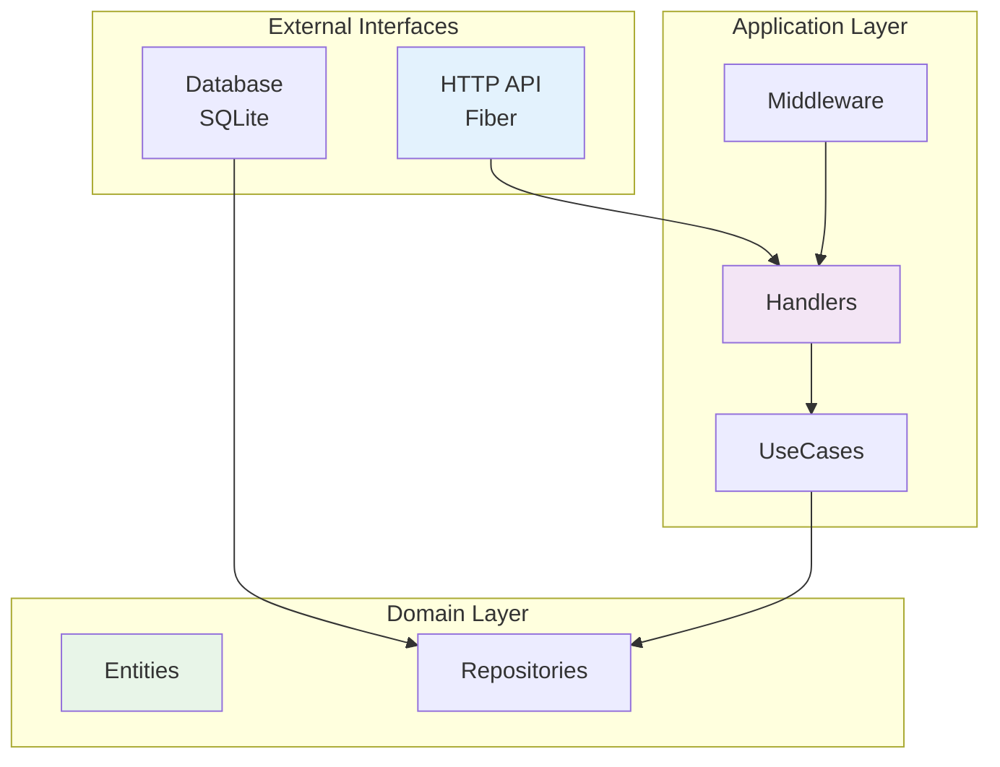

# 🌐 BookCabin Backend - Airline Voucher & Seat Assignment

A robust and efficient backend web application designed to streamline airline voucher and seat assignment processes. This system offers randomized seat selection for crew vouchers, prevents duplicate assignments, and provides comprehensive management capabilities for airlines.

## 📋 Table of Contents

- [🏗️ Architecture Overview](#️-architecture-overview)
- [📁 Project Structure](#-project-structure)
- [🔌 API Documentation](#-api-documentation)
- [🚀 Getting Started](#-getting-started)
  - [Prerequisites](#prerequisites)
  - [Installation](#installation)
- [🐳 Docker Support](#-docker-support)
  - [Build Docker Image](#build-docker-image)
  - [Run with Docker](#run-with-docker)
- [🛠️ Development](#️-development)
  - [Available Make Commands](#available-make-commands)
  - [Development Workflow](#development-workflow)
- [🔒 Security Features](#-security-features)
- [📈 Performance Considerations](#-performance-considerations)

## 🏗️ Architecture Overview

### System Architecture


## 🚀 Features

### Technical Features
- **RESTful API**: Standardized REST endpoints with proper HTTP status codes
- **Request Validation**: Comprehensive input validation using go-playground/validator
- **Error Handling**: Structured error responses with detailed error messages
- **Logging**: Structured logging with Logrus for debugging and monitoring
- **Security**: CORS, CSRF protection, rate limiting, and secure headers
- **Database**: SQLite with GORM ORM
- **Performance**: Connection pooling, compression, and optimized queries

## 🛠️ Technology Stack

### Core Framework & Libraries
- **Go 1.24.2**: Primary programming language
- **Fiber v2.52.8**: High-performance HTTP framework
- **GORM v1.30.0**: Object-Relational Mapping for database operations
- **SQLite**: Primary database

### Authentication & Security
- **CORS**: Cross-Origin Resource Sharing configuration
- **CSRF**: Cross-Site Request Forgery protection
- **Rate Limiting**: Request rate limiting for API protection

### Validation & Serialization
- **Validator v10.26.0**: Request validation using struct tags
- **Sonic v1.13.3**: High-performance JSON serialization/deserialization

### Utilities & Configuration
- **Viper v1.20.1**: Configuration management
- **Logrus v1.9.3**: Structured logging
- **UUID v1.6.0**: UUID type generator
- **Air**: Hot reload for development

### Database Drivers
- **SQLite Driver**: Native SQLite support with connection pooling

## 📁 Project Structure

```
backend/
├── cmd/                  # Application entry point
│   └── main.go           # Main application bootstrap
├── config/               # Configuration management
│   ├── config.go         # Configuration loader
│   ├── config.json       # Application configuration
│   └── types.go          # Configuration types
├── database/             # Voucher database
│   └── vouchers.db       # Voucher database
├── internal/             # Internal application code
│   ├── app/              # Application bootstrap
│   ├── entity/           # Domain entities/models
│   ├── handler/          # HTTP request handlers
│   ├── model/            # Request/response models
│   ├── repository/       # Data access layer
│   ├── route/            # Route definitions
│   ├── usecase/          # Business logic layer
│   └── utils/            # Utility functions
├── pkg/                  # Reusable packages
│   ├── database/         # Database utilities
│   ├── fiber/            # Fiber framework setup
│   ├── logger/           # Logging utilities
│   ├── middleware/       # Common middleware
│   └── validator/        # Validation utilities
├── Dockerfile            # Docker image definition
├── go.mod                # Go module definition
├── go.sum                # Go module checksums
├── Makefile              # Build and deployment scripts
└── README.md             # Project documentation
```

## 🔌 API Documentation

### Base URL
```http
http://localhost:4000/api
```

### Interactive API Documentation (Swagger)

The API provides comprehensive interactive documentation using Swagger/OpenAPI 3.0:

**Access Swagger UI:**
```
http://localhost:4000/swagger/
```

**Setup:**
```bash
# Generate Swagger documentation
make swagger-gen

# Start the server
make run-dev
```

### API Endpoints

#### 1. Check Crew Voucher
Check if a crew voucher exists for a specific flight and date.

```http
POST /api/check
Content-Type: application/json
```

**Request Body:**
```json
{
    "flightNumber": "GA10211",
    "date": "2025-07-12"
}
```

**Response:**
```json
{
    "success": true,
    "exists": false
}
```

**Response Codes:**
- `200 OK`: Successfully checked voucher existence
- `400 Bad Request`: Invalid request format or missing required fields
- `500 Internal Server Error`: Server error during voucher check

---

#### 2. Generate Crew Voucher
Generate a new crew voucher with randomized seat assignments.

```http
POST /api/generate
Content-Type: application/json
```

**Request Body:**
```json
{
    "name": "Sarah",
    "id": "98123",
    "flightNumber": "GA10211",
    "date": "2025-07-12",
    "aircraft": "Airbus 320"
}
```

**Response:**
```json
{
    "success": true,
    "seats": [
        "11F",
        "22B",
        "5A"
    ]
}
```

**Response Codes:**
- `200 OK`: Successfully generated voucher and assigned seats
- `400 Bad Request`: Invalid request format or missing required fields
- `500 Internal Server Error`: Server error during voucher generation

---

#### 3. List Aircraft Seats
Get all available seats for a specific aircraft type.

```http
GET /api/aircraft/seats?type=ATR
Content-Type: application/json
```

**Query Parameters:**
- `type` (required): Aircraft type (e.g., "ATR", "Airbus 320", "Boeing 737")

**Response:**
```json
{
    "success": true,
    "data": [
        {
            "row_number": 1,
            "seat": "A",
            "assigned": false
        },
        {
            "row_number": 1,
            "seat": "C",
            "assigned": false
        },
        {
            "row_number": 2,
            "seat": "A",
            "assigned": true
        }
    ]
}
```

**Response Codes:**
- `200 OK`: Successfully retrieved aircraft seats
- `400 Bad Request`: Missing or invalid aircraft type parameter
- `500 Internal Server Error`: Server error during seat retrieval

---

### Request/Response Models

#### Check Voucher Request
```json
{
    "flightNumber": "string (required)",
    "date": "string (required, format: YYYY-MM-DD)"
}
```

#### Generate Voucher Request
```json
{
    "name": "string (required)",
    "id": "string (required)",
    "flightNumber": "string (required)",
    "date": "string (required, format: YYYY-MM-DD)",
    "aircraft": "string (required)"
}
```

#### Seat Model
```json
{
    "row_number": "integer",
    "seat": "string",
    "assigned": "boolean"
}
```

#### Standard Response Format
```json
{
    "success": "boolean",
    "message": "string (optional)",
    "data": "object (optional)",
    "error": "string (optional)"
}
```

### Error Handling

All API endpoints return consistent error responses:

```json
{
    "success": false,
    "error": "Error message description",
    "code": "ERROR_CODE"
}
```

### Rate Limiting

The API implements rate limiting to prevent abuse:
- **Limit**: 100 requests per minute per IP address
- **Headers**: Rate limit information is included in response headers
- **Exceeded**: Returns `429 Too Many Requests` when limit is exceeded

## 🚀 Getting Started

### Prerequisites
- Go 1.24.2 or higher
- SQLite
- Make (for build automation)
- Docker

### Installation

1. **Clone the repository**
```bash
git clone <repository-url>
cd bookcabin/backend
```

2. **Install dependencies**
```bash
go mod download
```

3. **Configure the application**

modify the configuration on `config/config.json`


4. **Set up the database**
```bash
# Run database migrations
make migrate-up
```

5. **Build and run the application**
```bash
# Development mode with hot reload
make run-dev

# Production mode
make run
```

## 🐳 Docker Support

### Build Docker Image

**Build the application Docker image:**
```bash
# Build Docker image
make docker-build

# Or manually build
docker build -t bookcabin-backend:latest .
```

**Build with specific tag:**
```bash
docker build -t bookcabin-backend:v1.0.0 .
```

### Run with Docker

**Run the application container:**
```bash
# Run with Docker
make docker-run

# Or manually run
docker run -d \
  --name bookcabin-backend \
  -p 8080:8080 \
  bookcabin-backend:latest
```

## 🛠️ Development

### Available Make Commands

```bash
# Database migrations
make migrate-create name=<migration_name>  # Create new migration
make migrate-up                            # Apply migrations
make migrate-down                          # Rollback last migration
make migrate-clean                         # Rollback all migrations
make migrate-status                        # Show migration status

# Build and run
make build                                 # Build the application
make run-dev                               # Run with hot reload
make run                                   # Run in production mode
make clean                                 # Clean build artifacts
make rebuild                               # Force rebuild

# Swagger documentation
make swagger-gen                           # Generate Swagger documentation
make swagger-serve                         # Serve Swagger UI (requires server running)

# Help
make help                                  # Show all available commands
```

### Development Workflow

1. **Create a new feature branch**
```bash
git checkout -b feature/your-feature-name
```

2. **Make your changes and test**
```bash
make run-dev
```

3. **Create database migration if needed**
```bash
make migrate-create name=add_new_table
```

4. **Run tests and build**
```bash
make build
```

5. **Commit and push your changes**
```bash
git add .
git commit -m "feat(<module>): add new feature"
git push origin feature/your-feature-name
```

## 🔒 Security Features

### API Security
- CORS configuration for cross-origin requests
- CSRF protection for state-changing operations
- Rate limiting to prevent abuse
- Input validation and sanitization
- Secure HTTP headers (Helmet.js equivalent)
- Parameterized SQL Queries - Prevents SQL injection attacks

## 📈 Performance Considerations

- Efficient query optimization with GORM
- Caching strategies for frequently accessed data